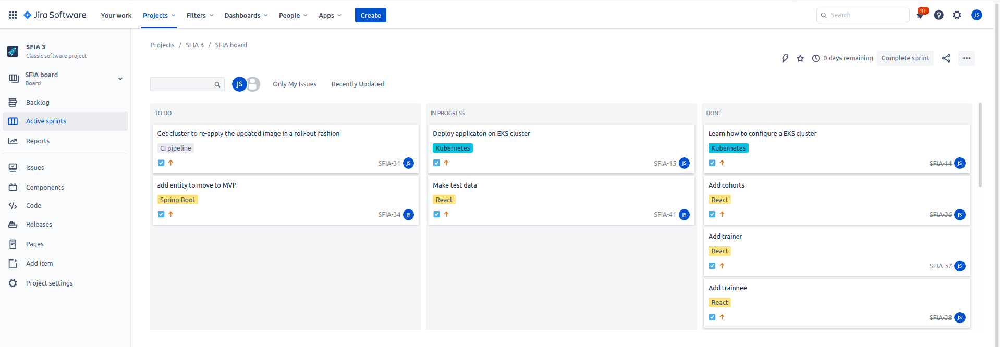
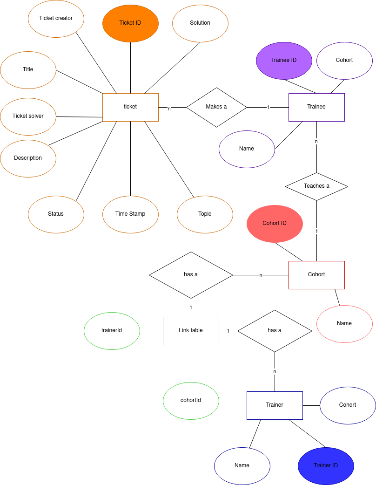
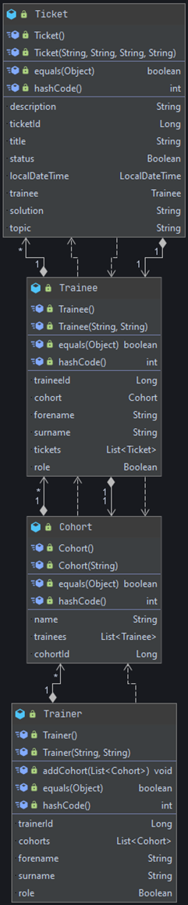
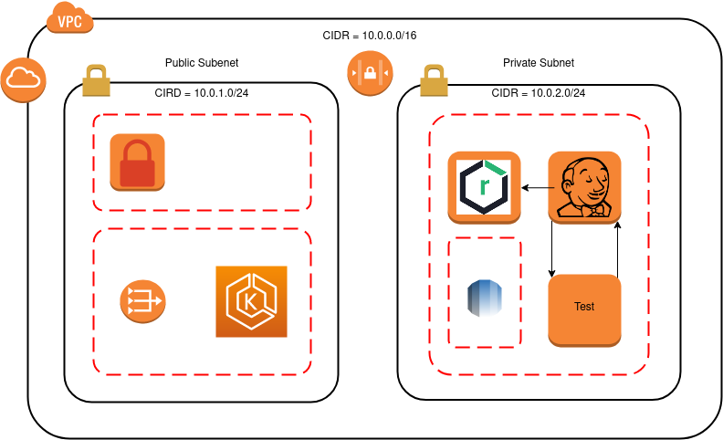
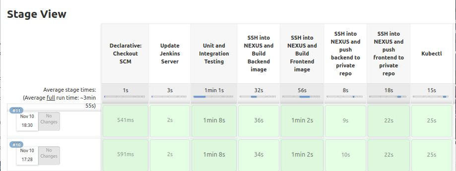
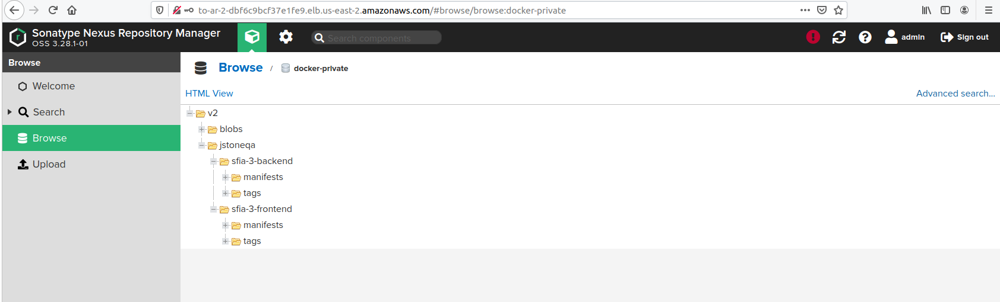
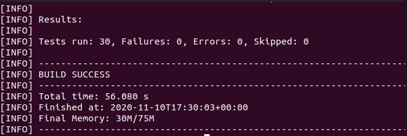

## QA Academy

### Cloud Native Engineer (DevOps) Learning Path

# Final Project

## Contents
* [Acknowledgements](#Acknowledgements)
* [Licensing & versioning](#Licensing-&-Versioning)
* [Brief](#Brief)
    * [Project Scope](#Project-Scope)
* [Planning](#Planning)
    * [Jira Board](#Jira-Board)
* [Design](#Design)
    * [Database Design](#Database-Design)
    * [Class Diagram](#Class-Diagram)
    * [Website Design](#Website-Design)
* [AWS Infrastructure](#AWS-Infrastructure)
* [MoSCoW](#MoSCoW)
    * [Must have](#Must-have)
    * [Should have](#Should-have)
    * [Could have](#Could-have)
    * [Would have](#Would-have)
* [Risk Assessment](#Risk-Assessment)
    * [Software Engineering](#Software-Engineering)
    * [DevOps](#DevOps)
    * [Team](#Team)
* [CI-Pipeline](CI-Pipeline)
* [Provisioning Services using Ansible](#Provisioning-Services-using-Ansible)
* [The use of Nexus](#The-use-of-Nexus)
* [Testing](#Testing)
    * [Unit and Integration Testing Results](#Unit-and-Integration-Testing-Results)
* [Future Updates](#Future-Updates)

## Acknowledgements

Acknowledgements go to:

* QA Academy
* Jay Grindrod (Learning Specialist)
* Jordan Harris (Senior Technical Learning Specialist)
* Savannah Vaithilingam (Technical Learning SPecialist)

## Licensing & Versioning

Version 1.0.1a

## Brief

### Project Scope

SFIA 3 is a group project that will enforce agile methodologies. The aim is to address the need to address a Help queuing collection application to be used in the academy as a training aid tool. The application is to be developed with full CRUD functionality and two features of the development team's choice. Additionally a full CI pipeline to integrate and deploy new code to showcase continuous integration.

## Planning

### Jira Board

The project was planned using Atlassian Jira board. The type of planning board used was a Scrum board. Scrum boards use sprints, designed to focus the work on tasks and user stories and provide a sense of progression through. The picture below shows the current state of sprint that is being completed. After this MVP will be reached.

 

## Design

 

### Database Design

 

[Back to Contents](#Contents)

### Class Diagram 

 

[Back to Contents](#Contents)

### Website Design

This image show the creation of a wire frame, that laid the foundation for the website site design. The wire frame allowed for the devlopment of the react app to be able to split the application into components, this plan made it clear as to how the data should be imported, either usind states or props. The image below the wire frame shows how the application looks on the frontend.

[Back to Contents](#Contents)

### AWS Infrastructure

There are two subnets in a VPC. The public subnet contains the bastion host, that allows devlopers to connect to the instances running on the private subenet.
The three EC2 instances running in the private subnet are the Jenkins Server, test VM and the arifact repository. These EC2 instance are able to connect to 
the internet via the NAT gateway, which always outboud traffic but doesn't allow inbound traffic. The NACL provides sercurity to the subnets by restricting traffic. 

[Back to Contents](#Contents)

## CI-Pipeline

[Back to Contents](#Contents)

## Provisioning Services using Ansible

The project requires the use of ansible to configure services.  Once Terraform has been provisioned the Virtual Machines (VM), Ansible then ssh’s into the the VM for Jenkins and configures it in such a way that the set up wizard is  bypassed and and a user is automatically created. This step helped in saving time during the whole CI pipeline process.

[Back to Contents](#Contents)

## The use of Nexus

In the CI-pipeline we build images for frontend and backend for the application and then push to the NEXUS private repository for safe keeping. The picture above shows successful push of images to the private repository.

[Back to Contents](#Contents)

# Testing

## Unit and Integration Testing Results

[Back to Contents](#Contents)

## MoSCoW 

### Must have...
* Application with full CRUD functionality.
* Git repository hosted in a VCS provider.
* CI server to handle automation.
* Webhook.
* Test of the application.
* High security.
* User Stories.
* Use Java as a programming language.
* Use Spring Boot as a web Frame work.
* A User Interface that is implemented with React.
* Micro-service Architecture.
* Terraform creates instances on AWS
* Use Ansible to configure the AWS instances.
* Use RDS instance to store data of application.
* A kubernetes cluster to deploy application.
### Should have...
* Two additional features implemented.
* Cohorts
* Filtering
### Could have...
* Full Automation of application
### Would have...
* Tagging

[Back to Contents](#Contents)

## Risk Assessment

### Software Engineering

|Description                                   |Assessment                                                                                                                                                                                   |Risk likelihood of occurring (1=low to 10=high)|Impact (1- 10)|Responsibility      |Proposed Mitigation                                                                                                                                                                                                                                     |Risk likelihood of occurring after mitigation in place (1 - 10)|Impact (1- 10)                                                                                                                                             |
|----------------------------------------------|---------------------------------------------------------------------------------------------------------------------------------------------------------------------------------------------|----------------------------------------------|--------------|-------------------|--------------------------------------------------------------------------------------------------------------------------------------------------------------------------------------------------------------------------------------------------------|--------------------------------------------------------------|-----------------------------------------------------------------------------------------------------------------------------------------------------------|
|Physical Hardware failure (Device crashes/failure)|If any of the development team suffer from device failures, they may not have access to any other devices which results in them not being able to continue with their current tasks          |2                                             |8             |Development Team   |Ensure that all devices are well maintained and up-to-date to prevent any crashes due to firmware being out of date. Ensure that no liquids are kept near the devices which could cause permanent damage or failure.                                    |1                                                             |8                                                                                                                                                          |
|Unrestricted access of process and files      |An attacker who gains access to one container may have the capability to gain access to other containers or the host.                                                                        |3                                             |9             |Jake Stone         |The access control best practice recommendations includes the principle of least privilege. The user namespace feature in Linux containers will allow developers to avoid root access by giving isolated containers separate user accounts, and mandate resource constraints, so users from one container do not have the capability to access other containers or exhaust all resources on the host.|3                                                             |9                                                                                                                                                          |
|Exposing sensitive data, (Key pairs, passwords etc)|Un wanted access to passwords and sensitive data could give access to DevOps software to attackers, allowing them to cause potential harm to the site.                                       |7                                             |9             |Development Team   |Use Environment variables to store sensitive data in safe locations so unwanted access isn't possible.                                                                                                                                                   |3                                                             |9                                                                                                                                                          |
|Implementation of new technologies and software|New Software and Technologies are constantly being rolled out and implemented into projects. This can be a risk due to the fact that the Software is yet to be tried and tested thoroughly throughout multiple projects. As a result of this errors can be encountered when implementing the new Software which may result in data loss or delays in development.|4                                             |7             |Development Team   |Ensure that if the development team are considering implementing any new Software or Technologies that they have researched them to see if they will integrate with the current project and doesn't have any reported issues with reliability or performance.|1                                                             |6                                                                                                                                                          |
|Untrained in React                            |Development team has some but not too much experience with react, meaning mistakes could be made that could possibly be detrimental to the project                                            |3                                             |7             |Development Team   |The development team is to undergo training so that they can improve their knowledge of act. This will allow them to work on this project with increased expertise and should lower the risks of critical mistakes being made drastically.             |1                                                             |7                                                                                                                                                          |
|Mis-communication resulting in redundant code |If there is not clear communication between the developers, this can lead to members working on the same area of the project and producing the same code twice which will end up being redundant and a waste of time. This could halt the progress of the project and cause a delay in the sprint.|5                                             |7             |Development Team   |The development team should ensure they are present for every daily stand up and are in constant communication to inform the rest of the team what they are currently working on to ensure everyone is clear on who is undertaking which task            |2                                                             |7                                                                                                                                                          |
|Poor coding practices                         |During development, if there isn't a clear formatting/code structure, the readability of the code can be very poor, especially for anybody new trying to read and understand the code. This means that extra time is needed to understand the application and then contribute further to it|5                                             |5             |Development Team   |A clear structure should be decided on and then followed when developing the application. This will ensure that any work is readable for the entire development team and any other personnel who want to read the code. Techniques such as consistent code layout, regular commenting and name signing on methods will make it much simpler for members of the current team and any potential new members to read and understand the application.|1                                                             |5                                                                                                                                                          |

[Back to Contents](#Contents)

### DevOps

|Description                                   |Assessment                                                                                                                                                                                   |Risk likelihood of occurring (1=low to 10=high)|Impact (1- 10)|Responsibility      |Proposed Mitigation                                                                                                                                                                                                                                    |Risk likelihood of occurring (1 - 10)                   |Impact (1- 10)                                                                                                                                             |
|----------------------------------------------|---------------------------------------------------------------------------------------------------------------------------------------------------------------------------------------------|----------------------------------------------|--------------|-------------------|--------------------------------------------------------------------------------------------------------------------------------------------------------------------------------------------------------------------------------------------------------|-------------------------------------------------------|-----------------------------------------------------------------------------------------------------------------------------------------------------------|
|Web server goes dark                          |If the VM running the web server shuts down the website will be rendered non functional                                                                                                      |2                                             |5             |Amazon web services|None                                                                                                                                                                                                                                                    |Set up a backup Vm in case the first one shuts down.   |1                                                                                                                                                          |
|SQL Database goes dark                        |If the SQL database service shuts down the website will be rendered non functional                                                                                                           |2                                           |2           |Amazon web services|None                                                                                                                                                                                                                                                    |Setup a backup database                                |Bring website down and attempt to spin database up again.                                                                                                  |
|HTTP traffic is being monitored by an attacker|Information being sent via http could easily be monitored.                                                                                                                                   |5                                        |5        |Development Team   |None                                                                                                                                                                                                                                                    |Set up connection across network to encrypt information|If this occurs it is unlikely the developer will be aware. Fortunately the information on the app does not contain sensitive data.                         |
|Time variable                                 |The developer is new to some of the technologies which may lead to more time than estimated for the completed system.                                                                        |7                                          |7          |Development Team   |Accomplish MVP first                                                                                                                                                                                                                                    |Consult upper level management                         |At first the minimal viable product should be developed to an acceptable standard. Thereafter the non-essential requirements of the site can be implemented|
|COVID - 19 / illness                          |The virus is still prevalent, despite lockdown measures. It would be very possible to contract the virus or some other disease that would render the developer unable to complete the project|2                                             |5             |Development Team   |Following government advice such as the use of face covering and social distancing when in contact with people. Through good communication, the remaining members of the development team would be able to take on extra workload to finish the project.|2                                                      |5                                                                                                                                                          |
|Kernel level threats (Docker)                 |Docker's design provides convenience however it also amplifies any vulnerabilities that are present in the kernel.                                                                           |3                                             |10            |Development Team   |Restricting unnecessary applications that run on privileged ports, allowing needed applications only.                                                                                                                                                    |1                                                      |10                                                                                                                                                         |

[Back to Contents](#Contents)

### Team

|Description                                   |Assessment                                                                                                                                                                                   |Risk likelihood of occurring (1=low to 10=high)|Impact (1- 10)|Responsibility      |Proposed Mitigation                                                                                                                                                                                                                                    |Risk likelihood of occurring (1 - 10)                   |Impact (1- 10)                                                                                                                                             |
|----------------------------------------------|---------------------------------------------------------------------------------------------------------------------------------------------------------------------------------------------|----------------------------------------------|--------------|-------------------|--------------------------------------------------------------------------------------------------------------------------------------------------------------------------------------------------------------------------------------------------------|-------------------------------------------------------|-----------------------------------------------------------------------------------------------------------------------------------------------------------|
|Team break down                               |Team becoming unable to work due social break downs within the group.                                                                                                                        |6                                             |10            |Team 4             |Use agile development methods to increase team cohesion. If team members are unable to work together move the team members to different roles within the project. If team members need to work on same part of the project try to resolve issues between team members with team mediation. If this fails then move the team members to a silo work structure so the work they have to complete together will be minimal.|2                                                      |10                                                                                                                                                         |
|Team member being Ill or not being able to be in work.|If a team member is sick and unable to work then their part of the project may become incomplete                                                                                             |5                                             |8             |Team 4             |If risk is to occur make sure there is another team member that can assume there role and complete their work. After team member is able to work then the needs to be a hand over of work that was completed my the back-up team member and work can continue.|5                                                      |4                                                                                                                                                          |
|Skewed Influence over Decisions               |A team member may not feel listen to and their ideas are not being taken seriously. This will lead to that team member not being motivated to complete the project to the best of their ability or moving to harm the success of the project.|4                                             |8             |Team 4             |Make sure everyone has chance to give input on their topic and make sure that dominant personalities within the group are reminded of the agile mind set and to always listen. Playing planning poker will give team members that may have a different point of view on things chance to speak up and voice there concerns.|1                                                      |5                                                                                                                                                          |
|Missing task skills                           |When a team member will either think that they are incompetent within an area and they are not and implement something that is insecure or the team member knows that they are incompetent within the area and no other team member can help work on the project area can lead to software being implemented incorrectly or insecurely. |8                                             |8             |Team 4             |For all team member to be highly critical of their own skills and if they do not feel comfortable implementing something they always have another team member in their area of the project. IF both team member in the DevOps and the Software engineering team feel as if they do not understand what they are doing properly the protocol to follow is to redo the modules on the QA web page and then complete a course on cloud academy so that they can ascertain an understanding of the topic. There are tests on Cloud Academy for the team member to assess their skill level objectively.|8                                                      |2                                                                                                                                                          |
|Groupthink                                    |This occurs when team members don't speak up when consensus of the team is to implement or complete a task in a certain way than they think is the best possible way.                        |9                                             |10            |Team 4             |Planning poker will mitigate the risk to a certain degree so that when a team member feels differently on a topic they won't have a team consensus before making their decision. This will lead to the individual providing reason as to why they believe a task should be done a certain way. Team members are also reminded that the they should always voice their opinion if they think the plan or tactic is incorrect or will lead to security issues |7                                                      |2                                                                                                                                                          |

[Back to Contents](#Contents)

## Future Updates

* Log in functionality for application
* Increased automation via use of Ansible to provision NEXUS

[Back to Contents](#Contents)